# Asset Management Operating Org

This is the evergreen employee map for `investment-management`. It turns the
skill into a full asset-management team while keeping one financial decision
owner. The `global-macro-theme-picker` package is the Macro Desk operating
manual and remains separately callable for locked downstream integrations. That
separate package is a stable child-desk route, not a competing investment owner.

For the complete all-skill visibility table, use
`references/skill-coverage-map.md`. The org chart below shows the investment
workforce; the coverage map shows every canonical skill that can support it.

Coverage is benchmarked against public capability maps from major
multi-strategy hedge funds, asset managers, and global markets platforms:
equities, fixed income/currency/commodities, global macro, liquid credit,
commodities, quantitative/systematic, venture/private capital, multi-asset,
liquidity, alternatives, markets research, trading, and execution.

Public source breadcrumbs:

- Citadel: `https://www.citadel.com/`
- Point72 what-we-do: `https://point72.com/what-we-do/`
- Point72 global macro: `https://point72.com/global-macro/`
- J.P. Morgan Asset Management capabilities: `https://am.jpmorgan.com/`
- J.P. Morgan Markets: `https://www.jpmorgan.com/markets`
- Goldman Sachs FICC and Equities: `https://www.goldmansachs.com/what-we-do/ficc-and-equities`
- Goldman Sachs Asset Management fixed income: `https://am.gs.com/en-us/advisors/products/fixed-income`

## Org Chart

```mermaid
flowchart TD
  IC["CIO / Investment Committee<br/>final capital judgment"]
  PM["Portfolio Manager<br/>mandate fit, sizing, risk budget"]
  RM["Research Director<br/>evidence quality, queue, challenge"]
  PC["Portfolio Construction<br/>covariance, liquidity, exposure, stress"]
  CR["Central Risk<br/>drawdown, VaR/ES, factor, crowding"]
  PR["Performance & Attribution<br/>benchmark, drawdown, post-cost review"]

  Macro["Global Macro Desk<br/>regime, themes, policy, cross-asset"]
  FICC["FICC Desk<br/>rates, FX, credit, commodities"]
  Equity["Equities Desk<br/>fundamental, factor, event, valuation"]
  Quant["Systematic / Quant Desk<br/>signals, backtests, OOS, capacity"]
  Deriv["Derivatives & Volatility Desk<br/>convexity, options, hedges"]
  VC["Venture Capital / Growth Equity Desk<br/>seed, growth, platform, reserves"]
  Alts["Alternatives / Private Markets Desk<br/>PE, private credit, real assets"]
  GIO["Global Investment Opportunities<br/>cross-asset, exotics, dislocations"]
  Digital["Digital Assets / Event Markets Desk<br/>basis, funding, probability, venue risk"]
  TA["Market Structure & Technical Desk<br/>trend, breadth, flows, replay"]
  AI["AI / ML Model Validation<br/>leakage, calibration, evals, challengers"]
  Exec["Execution, Financing & Treasury<br/>entry, costs, liquidity, borrow, collateral"]
  Bear["Falsification Desk<br/>bear case, crowding, breakpoints"]
  Ops["Research Operations<br/>source registry, audit trail, memory"]

  IC --> PM
  IC --> RM
  PM --> PC
  PM --> CR
  PM --> PR
  RM --> Macro
  RM --> FICC
  RM --> Equity
  RM --> Quant
  RM --> Deriv
  RM --> VC
  RM --> Alts
  RM --> GIO
  RM --> Digital
  RM --> TA
  RM --> AI
  RM --> Bear
  RM --> Ops
  PM --> Exec
  Macro -. "stable child package" .-> GMT["global-macro-theme-picker"]
```

## Command Layer

### CIO / Investment Committee

- Owns final investment judgment, mandate fit, approval boundary, and capital
  risk.
- Accepts, modifies, rejects, or defers recommendations.
- Does not outsource final judgment to plugins, models, or subskills.

### Portfolio Manager

- Converts research into portfolio-aware recommendations.
- Owns sizing method, concentration, factor exposure, liquidity, correlation,
  leverage, and review cadence.
- Requires benchmark and invalidation before scale.

### Portfolio Construction

- Owns covariance, risk contribution, sleeve balance, liquidity, gross/net,
  leverage, cash, rebalance, and denominator risk.
- Converts desk ideas into portfolio-aware sizing proposals only.

### Central Risk

- Owns drawdown, VaR/ES, stress, factor, beta, liquidity, gap, crowding,
  counterparty, financing, and model-risk challenge.
- Can force `WAIT`, `REDUCE`, or `KILL` recommendations; cannot approve live
  execution alone.

### Performance And Attribution

- Owns benchmark-relative review, factor attribution, selection/timing split,
  cost/slippage attribution, drawdown explanation, and decision ledger updates.

## Investment Desks

### Global Macro Desk

- Uses `global-macro-theme-picker` as its unchanged operating manual.
- Covers liquidity, policy, inflation, growth, rates/curves, FX, commodities,
  credit, country and regional equity themes, reserve assets, fiscal/structural
  themes, price-aware entry states, expression comparison, and paper-book risk.
- Produces research or paper recommendations only. Downstream project consumers
  receive sanitized theme handoffs from the same top-level package path.

### FICC Desk

- Rates: sovereign curves, swaps, real rates, inflation breakevens, duration,
  term premia, policy path, and rates volatility.
- FX: G10, EM FX, dollar regime, carry, balance-of-payments pressure, real-rate
  differentials, intervention risk, and cross-currency basis.
- Credit: IG, HY, loans, CDS, spread decomposition, downgrade/default paths,
  documentation risk, and relative value.
- Commodities: energy, power, metals, agriculture, inventories, term structure,
  carry, seasonality, geopolitical disruption, and roll yield.
- Structured credit: MBS, ABS, CLOs, CMBS, tranche risk, prepayment, extension,
  convexity, collateral quality, and liquidity.

### Equities Desk

- Owns company research, valuation, estimates, catalysts, variant perception,
  factor exposures, and thesis tracking for listed equities.
- Sector pods: software, semis, hardware, internet, media, telecom, consumer
  discretionary, staples, restaurants, healthcare services, biotech, pharma,
  medtech, banks, insurance, asset managers, fintech, industrials, aerospace,
  defense, transports, autos, energy, utilities, renewables, materials, real
  estate, REITs, infrastructure, small/mid cap, international developed, and
  emerging markets.
- Style/event sleeves: quality, value, growth, momentum, low volatility,
  compounders, turnarounds, shorts, pairs, earnings, estimate revisions,
  spinoffs, index changes, buybacks, activism, restructurings, merger
  arbitrage, and special situations.
- Uses bundled public-equity plugin material only as support/QC when useful.

### Systematic / Quant Desk

- Owns signal research, baselines, causal timestamps, walk-forward evaluation,
  transaction costs, capacity, turnover, and promotion discipline.
- Covers systematic equities, statistical arbitrage, futures trend/carry,
  cross-asset risk premia, factor timing, alpha capture, alternative data,
  NLP/filings, market microstructure, execution models, and portfolio
  optimization challengers.
- Keeps analytical changes staged unless explicitly approved.

### Derivatives And Volatility Desk

- Owns option structure, convexity, volatility carry, tail hedges, and nonlinear
  payoff analysis.
- Covers equity vol, rates vol, FX vol, commodity vol, dispersion, variance,
  skew, vol-of-vol, structured payoff replication, collar/put-spread overlays,
  and crisis convexity.
- Must show path risk, greeks, liquidity, scenario loss, and hedge failure.

### Venture Capital / Growth Equity Desk

- Uses `references/venture-capital-operating-desk.md` as its operating manual.
- Covers seed, venture, growth equity, pre-IPO/crossover, secondaries, fund and
  manager diligence, AI, enterprise, infra/devtools, cyber, fintech, consumer,
  marketplaces, bio/health, hard tech, climate/energy, crypto, games/media,
  geography coverage, platform value creation, and reserve strategy.
- Routes debt, M&A, venture debt, structured finance, covenants, closing
  conditions, and legal/credit structuring to `universal-banker`.

### Alternatives And Private Markets Desk

- Covers private equity, private credit, real estate, infrastructure, real
  assets, secondaries, co-investments, fund commitments, pacing, reserves,
  DPI/TVPI/IRR quality, J-curve, marks, liquidity gates, and denominator risk.
- Routes borrower-level underwriting, lender negotiation, covenant design, and
  legal/credit structuring to `universal-banker`.

### Global Investment Opportunities / Exotics Desk

- Owns cross-asset dislocations, capital scarcity, forced selling, balance-sheet
  stress, policy discontinuities, corporate actions, relative-value packages,
  exotics, structured notes, insurance-linked risk, litigation/regulatory
  overhangs, tax-aware wrappers, and opportunistic allocations that do not fit a
  clean sleeve.
- Must define why the opportunity is misclassified, who is forced to act, what
  unlocks value, how it can be expressed cleanly, and what breaks it.
- Routes legal, tax, lender, and documentation questions to `universal-banker`,
  `corporate-counsel`, or `tax-strategy`.

### Digital Assets / Event Markets Desk

- Covers crypto spot, perpetuals/futures, basis, funding, staking, stablecoins,
  tokenomics, protocol risk, DeFi venue risk, prediction markets, event
  resolution, market making, and custody/connector boundaries.
- Venue capability is never inferred from a similar venue or framework.

### Market Structure And Technical Desk

- Uses `technical-analysis` for chart, breadth, flow, trend, momentum, and
  causal replay evidence.
- Produces support packets only. Capital decisions route back to the Portfolio
  Manager and CIO.

## Platform Desks

### AI / ML Model Validation

- Uses `ai-ml-research-lab` for leakage checks, calibration, ablations, model
  cards, agent evals, and challenger design.
- A model can improve a decision packet; it cannot authorize capital.

### Execution, Financing And Treasury

- Converts approved research into entry logic, order-type alternatives, TCA,
  cost estimates, liquidity constraints, and monitoring plans.
- Covers trade scheduling, spread/slippage, dark/lit venue choice, futures roll,
  borrow, securities lending, collateral, margin, cash management, FX
  settlement, prime-broker exposure, counterparty limits, and operational stops.
- Has no default live execution authority.

### Falsification Desk

- Attacks mechanism, data freshness, consensus/crowding, omitted variables,
  implementation cost, hidden exposure, and thesis-neutral downside.
- Must produce decision-changing objections, not performative skepticism.

### Research Operations

- Maintains source registry, evidence cards, promotion/rejection journal,
  decision ledgers, automation, sync/parity receipts, and provenance archives.
- Keeps proprietary implementation names in provenance files unless specifically
  needed for a local project.

## Maximum Desk Coverage Matrix

| Desk | Subdesks | Default output |
|---|---|---|
| CIO / IC | mandate, approval, governance, conflicts | decision memo |
| Portfolio Management | sleeve fit, sizing, constraints, exposures | action proposal |
| Portfolio Construction | covariance, risk contribution, liquidity | sizing/risk budget |
| Central Risk | VaR/ES, drawdown, factor, crowding, gap | risk accept/reduce memo |
| Performance Attribution | benchmark, factor, selection, timing, costs | post-mortem |
| Global Macro | regime, policy, liquidity, cycle, themes | macro packet |
| Rates | curves, swaps, real rates, inflation, rates vol | rates thesis |
| FX | G10, EM FX, dollar, carry, cross-currency basis | FX thesis |
| Commodities | energy, metals, ags, term structure, inventory | commodity thesis |
| Liquid Credit | IG, HY, loans, CDS, curves | credit RV/thesis |
| Structured Credit | MBS, ABS, CLOs, CMBS, tranches | structured credit memo |
| Distressed / Special Situations | stress, restructuring, recovery | capital-structure memo |
| Convertibles / Capital Structure Arb | converts, credit-equity-vol link | arb packet |
| Public Equities | sectors, valuation, revisions, catalysts | equity thesis |
| Long/Short Equity | longs, shorts, pairs, factor neutral | L/S pitch |
| Event-Driven Equity | earnings, M&A, spinoffs, activism, index | event packet |
| ETFs / Index / Flows | creations, redemptions, index changes | flow-risk note |
| Systematic Equities | factors, stat arb, alpha capture | research packet |
| Futures / CTA | trend, carry, seasonality, cross-asset | systematic macro packet |
| Alt Data / NLP | filings, web, news, transcripts, features | feature card |
| Market Microstructure | order book, flows, toxicity, fills | microstructure packet |
| Derivatives | options, variance, dispersion, overlays | options structure |
| Volatility / Convexity | skew, vol-of-vol, crash, hedges | convexity memo |
| Digital Assets | crypto, DeFi, basis, custody, venue risk | digital asset packet |
| Prediction Markets | probability, resolution, liquidity, decay | event-market packet |
| Global Investment Opportunities | cross-asset dislocations, exotics, forced selling | opportunistic memo |
| Venture Capital / Growth Equity | seed, growth, platform, reserves, secondaries | VC investment memo |
| Private Equity | buyouts, funds, directs, co-invests, pacing | private investment memo |
| Private Credit | sponsor/lender risk, covenants, marks | memo plus banker handoff |
| Real Assets | real estate, infrastructure, timber, transport | real-assets memo |
| Multi-Asset / OCIO | policy portfolio, tactical overlay, alts | allocation memo |
| Liquidity / Treasury | cash, T-bills, repo, sweep, collateral | liquidity ladder |
| Execution | order plan, TCA, cost, slippage | trade plan proposal |
| Financing / Prime | borrow, margin, collateral, counterparty | financing risk note |
| Data Engineering | datasets, lineage, point-in-time integrity | data readiness card |
| AI / ML Validation | leakage, calibration, challengers, eval | model card |
| Falsification | bear case, invalidation, omitted variables | challenge memo |
| Research Ops | source registry, ledgers, automation, parity | audit receipt |

## Sector Research Coverage

Every sector pod should maintain company maps, KPI trees, unit economics,
valuation regimes, factor exposure, ownership/crowding, supply chains, regulatory
risk, catalyst calendars, and short theses.

| Sector | Coverage |
|---|---|
| Technology | software, cloud, AI, semis, hardware, networking, cybersecurity, IT services |
| Internet / Media / Telecom | platforms, ads, streaming, gaming, cable, wireless, towers, satellites |
| Consumer | discretionary, staples, restaurants, retail, luxury, travel, leisure |
| Healthcare | pharma, biotech, medtech, tools, services, payors, providers |
| Financials | banks, brokers, exchanges, insurers, asset managers, fintech, specialty finance |
| Industrials | aerospace, defense, transports, machinery, automation, building products |
| Energy | E&P, integrateds, services, midstream, refining, LNG, power markets |
| Materials | chemicals, metals, mining, paper, packaging, construction materials |
| Real Estate | REITs, homebuilders, data centers, logistics, office, multifamily, lodging |
| Utilities / Infrastructure | regulated utilities, renewables, grids, pipelines, airports, ports, roads |
| Small / Mid Cap | underfollowed compounders, liquidity discounts, catalysts, governance |

## Geography Coverage

Every regional team should maintain country risk, policy regime, currency
exposure, local liquidity, governance, accounting, capital controls, sanctions,
tax/withholding issues, and investability constraints.

| Region | Coverage |
|---|---|
| United States | policy, sectors, earnings, rates, liquidity, fiscal impulse |
| Canada | banks, commodities, housing, FX, rates |
| Europe | EU core, UK, Nordics, periphery, banks, energy, fiscal rules |
| Japan | policy normalization, FX, exporters, governance reform, rates |
| Developed Asia / Pacific | Australia, Korea, Taiwan, Singapore, Hong Kong |
| China | policy, property, credit, tech, geopolitics, ADR/H-share/A-share channels |
| India | growth, banks, consumption, infrastructure, currency, valuation |
| Latin America | Brazil, Mexico, Chile, fiscal, commodities, rates, FX |
| EMEA Emerging | Eastern Europe, Middle East, Africa, sanctions, energy, banks |
| Frontier / Special Access | liquidity, custody, capital controls, political risk, sizing limits |

## Opportunistic And Exotic Coverage

- Cross-asset relative value: equity-credit, rates-FX, commodity-FX,
  volatility-credit, public-private marks.
- Capital structure: loans, bonds, converts, preferreds, warrants, equity,
  CDS, recovery paths, and control-point securities.
- Exotics: variance swaps, dispersion, structured notes, callable/putable
  structures, autocallables, path-dependent payoffs, quanto/cross-currency risk.
- Insurance-linked and catastrophe risk: event probability, attachment,
  exhaustion, seasonality, collateral, and liquidity.
- Legal/regulatory overhangs: litigation, antitrust, sanctions, tariffs,
  license risk, settlement optionality.
- Forced-flow opportunities: index rebalances, redemptions, margin calls,
  balance-sheet cleanup, end-of-quarter constraints, dealer positioning.

## Staffing Presets

- Fast screen: Research Director, one relevant Desk Analyst, Falsification Desk,
  Portfolio Manager.
- Macro book: Macro Desk, Portfolio Construction, Falsification, CIO.
- Quant challenger: Systematic Research, AI/ML Model Validation, Execution Cost,
  Portfolio Construction, Falsification.
- Public equity thesis: Public Equity, Macro, Technical/Market Structure,
  Falsification, Portfolio Manager.
- Full firm: all desks only when the decision size or complexity justifies the
  token and coordination cost.

Do not deploy every desk by habit. Use the smallest team that can make the
decision stronger.
